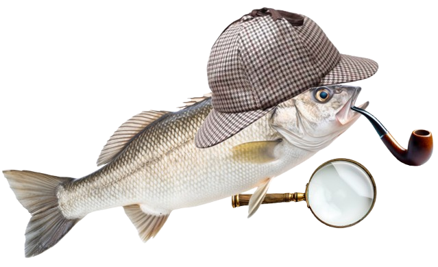

<div align="center">
  
</div>

# fish-fd

A `fd` plugin for the Fish shell.

### Installation

Install with [fisher](https://github.com/jorgebucaran/fisher):

```shell
fisher install givensuman/fish-fd
```

### Usage

Replaces `find` with an `fd` wrapper. To run the normal `find` command, use `rfind`.

### Environment variables

| Variable  | Description                            | Default                            |
| --------- | -------------------------------------- | ---------------------------------- |
| fd_params | `fd` params to be used with every call | `--hidden --follow --exclude .git` |

### Aliases

```shell
alias fd  'fd $fd_params'
alias fda 'fd $fd_params --no-ignore' # Search all files not in .gitignore
alias fdd 'fd $fd_params --type d'    # Find directories only
alias fdf 'fd $fd_params --type f'    # Find files only
alias fdx 'fd $fd_params --type x'    # Find executables only
alias fde 'fd $fd_params --extension' # Find by extension
```

### Requirements

Just requires [fd](https://github.com/sharkdp/fd)!

### License

[MIT](./LICENSE)
